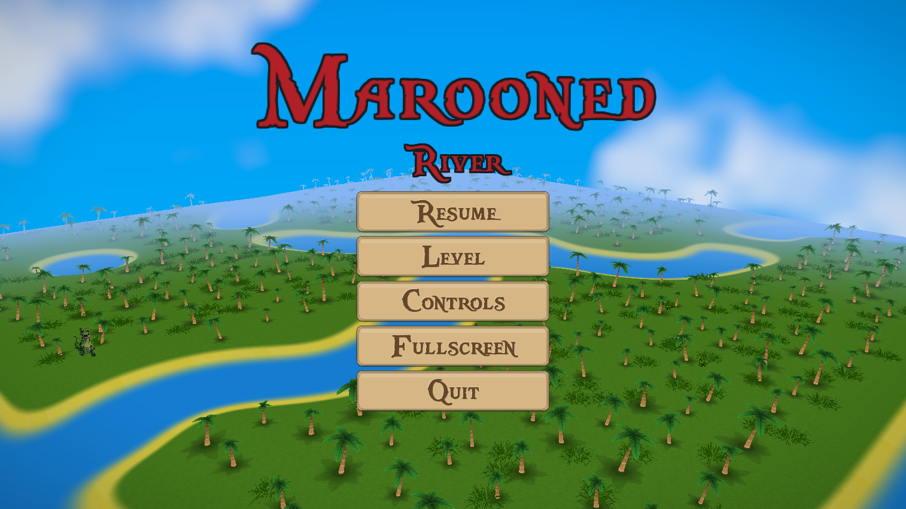

# Marooned


**Marooned** is a 3D first person adventure game set in the 1700s pirate era on a island full of dinosaurs. Below the islands are dungeons crawling with skeletons, and worse. Armed with only a rusty sword and your trusty blunderbuss, make your way through the dungeons to fight the boss at the end of the demo. 

### Table of Contents
- [Features](#features)
- [Installation](#installation)
- - [Windows](#windows)
- - [Linux](#linux)
- [Contributing](#contributing)
- [License](#license)

## Features
- Fully 3D environments.
- 2D "billboard" enemies with unique AI.
- Over world island maps generated from 4k grayscale images. 
- Dungeons generated from PNG image pixel by pixel.
- Combat with a blunderbuss, sword and a magic staff.
- Collectible weapons, potions and gold.
- A boss at the end of the game.


## Installation
### Windows
#### Prerequisites
Install:
- [Git](https://git-scm.com/downloads)
- [MinGW-w64](https://www.mingw-w64.org/) or another C++ compiler
- [Raylib 5.5](https://www.raylib.com/)

#### Build Steps
1. Clone the repository:
```bash
git clone https://github.com/Jhyde927/Marooned.git
```
2. Navigate to the repository:
```bash
cd Marooned
```

3. Build the project with Make:
```bash
make
```
4. Run `Marooned.exe`. The assets folder and all `.dll` files must be in the same folder in which the executable is run. 

### Linux
#### Prerequisites
You must install git, make (or cmake), a c++ compiler and raylib 5.5. Example on Ubuntu-based distributions:
```bash
sudo apt update
sudo apt install git make cmake gcc g++
sudo apt install build-essential libasound2-dev libx11-dev libxrandr-dev libxi-dev libgl1-mesa-dev libglu1-mesa-dev libxcursor-dev libxinerama-dev libwayland-dev libxkbcommon-dev # Required for building raylib
git clone https://github.com/raysan5/raylib.git
cd raylib
mkdir -p build
cd build
cmake ..
make
sudo make install
```
#### Install Steps
1. Clone the repository:
```bash
git clone https://github.com/Jhyde927/Marooned.git
```

2. Navigate to the repository:
```bash
cd Marooned
```

3. Build the project with Make:
```bash
make
```
Or build with CMake:
```bash
mkdir -p build
cd build
cmake ..
make
```
You can install library files using `make install`, but it is not required for running the program.

4. Run `Marooned` or `build/marooned` depending on how you built. The assets folder and all `.so`/`.a` files (if ran `make install`) must be in the same folder in which the executable is run.

## Contributing
Feel free to create PRs or issues. To create a PR:

1. Fork the repository.
2. Create a new branch:
```bash
git checkout -b feature-name
```
3. Make your changes.
4. Push your branch:
```bash
git push origin feature-name
```
5. Create a pull request and describe made changes.

## License
This project is licensed under the [MIT License](LICENSE.txt). Feel free to use, copy, modify, distribute and sell this project.
